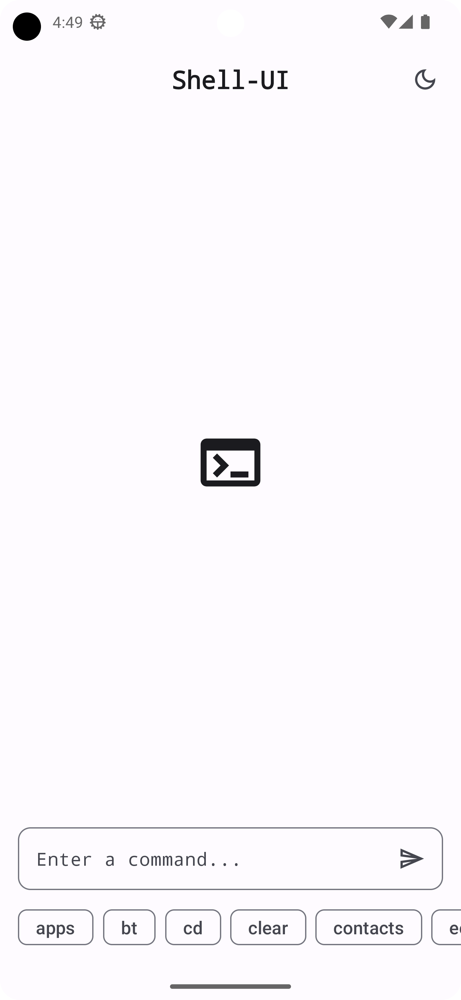
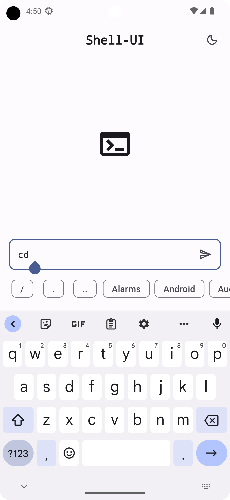

# Shell-UI (work-in-progress 👷🔧️👷‍♀️⛏)

This is a **work in progress** app inspired by the [t-ui launcher](https://github.com/fAndreuzzi/TUI-ConsoleLauncher) app. I built this app to follow it's successor "t-ui" and provide more minimalistic and clean home screen ui with more of what I think important features.

## Android Development

This app:

 * Written entirely in [Kotlin](https://kotlinlang.org).
 * Uses [Jetpack compose](https://developer.android.com/jetpack/compose) for it's UI.
 * Depends heavily on [Kotlin Coroutines](https://kotlinlang.org/docs/reference/coroutines/coroutines-guide.html).
 * Uses [Room](https://developer.android.com/jetpack/androidx/releases/room) for it's database.

## Screenshots

